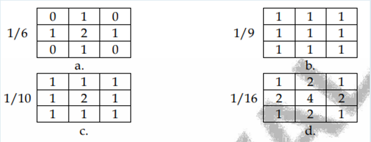

<h1 align = "center"><b>TUGAS KEDELAPAN</b></h1>

----
KELOMPOK 2 
Nama Anggota: 
Ahmad Adieb Ibrahim (1710131210001) 
Difana Nanda Pridhasila Zein (2110131220017) 
Rapiyah Hawa Nur (1810131120017) 
Risalatul Husna (2110131120008)  

<b>SOAL :</b>  Buatlah Kode Program Octave tentang Low Pass Filtering dan High Pass Filtering

#
<h1 align = "center"><b>PENYELESAIAN</b></h1>

---
#
# __LOW PASS FILTERING__

<b>Low Pass Filtering (LPF)</b> : Proses filter yang melewatkan komponen citra dengan nilai intensitas yang rendah dan meredam komponen citra dengan nilai intensitas yang tinggi. Low Pass Filter disebut juga smoothing filter yang merupakan salah satu metode untuk menghilangkan noise acak, noise berkala, dan menampilkan pola latar belakang. 

Low pass filtering digunakan untuk membuat citra menjadi lebih halus dan lebih blur. Efek pengaburan ini disebut dengan efek blurring.

#
## *Ciri-ciri Kernel Low Pass Filtering*

- Jumlah semua elemen kernel bernilai satu. 

- Elemen kernel tidak ada yang bernilai negatif

- Tinggi dan lebar kernel ganjil, jika tidak bernilai ganjil maka piksel pusat tidak bisa ditemukan.

- Bobot dalam kernel bersifat simetris terhadap piksel pusat

#
## *Cara Menghitung Low Pass Filtering*

Low pass filtering dilakukan dengan melakukan konvolusi antara citra dan kernel. Contoh kernel low pass filtering menggunakan matriks 3x3

#
## *Pseudocode*

Untuk Semua

Pada Octave

#
## *Implementasi Low Pass Filtering dengan Octave*

#
### ___1) Kode Program Manual___
 

Kode Program

Output Kode Program

Citra Asli

#
### ___1) Kode Program Yang Sudah ada pada Octave___
 

Kode Program

Output Kode Program

Output Kode Program

Output Kode Program

Citra Asli

#
# __HIGH PASS FILTERING__

<b>High Pass Filter (HPF</b> adalah proses filter yang mengambil citra dengan gradiasi intensitas yang tinggi dan perbedaan intensitas yang rendah akan dikurangi atau dibuang. High Pass Filtering adalah salah satu dari metode penajaman (sharpening).
 

Tujuan utama dari proses penajaman ini adalah untuk menyoroti detail-detail halus dalam gambar atau untuk meningkatkan detail yang telah dikaburkan baik dalam kesalahan atau efek alami dari proses akuisisi citra tertentu.

#
## *Kegunaan High Pass Filtering*

- High-Pass Filter sering disebut juga sebagai filter penajaman tepi (edge sharpening) karena HPF digunakan dalam proses penajaman citra. 

- Operasi penajaman citra bertujuan untuk memperjelas tepi pada objek di dalam citra atau menghilangkan bagian citra yang lembut.

- Karena penajaman citra lebih berpengaruh pada tepi (edge) objek, maka penajaman citra sering disebut juga penajaman tepi (edge sharpening) atau peningkatan kualitas tepi (edge enhancement).

#
## *Ciri-ciri Kernel High Pass Filtering*
- Koefisien penapis boleh negatif, nol, ataupun bernillai positif.

- Total keseluruhan koefisiennya ialah bernilai 0 ataupun 1.

- Apabila jumlah koefisiennya berjumlah = 0, maka setiap elemen yang rendah frekuensinya nilainya akan menurun. 

- Namun, apabila total dari koefisien adalah = 1, maka elemen yang memiliki frekuensi rendah nilainya tetap sama dengan nilai semula

#
## *Implementasi High Pass Filtering dengan Octave*

#
### ___1) Kode Program Manual___
 

Kode Program

Output Kode Program

<h3><b><i>2) Kode Program Yang Sudah ada pada Octave</i></b></h3>
 

Kode Program

Output Kode Program

Output Kode Program

Output Kode Program

Output Kode Program

Output Kode Program

Output Kode Program

