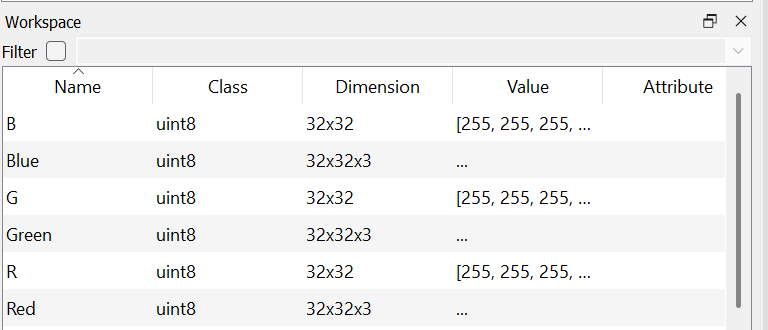
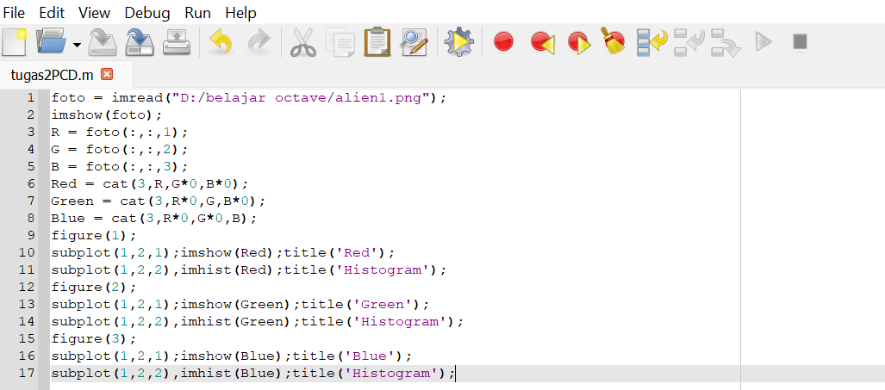
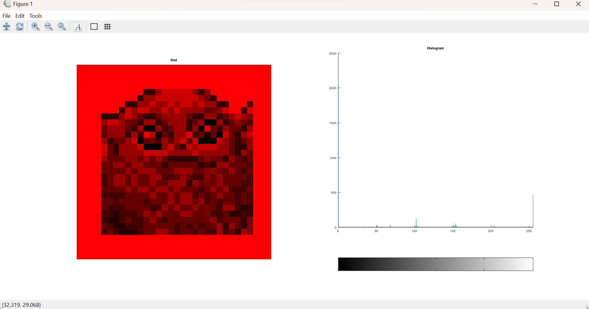
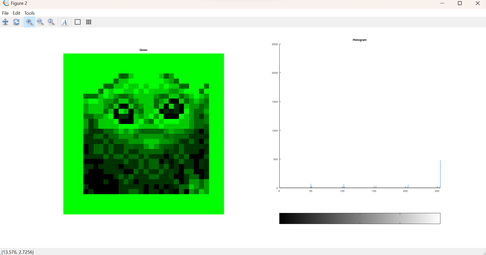
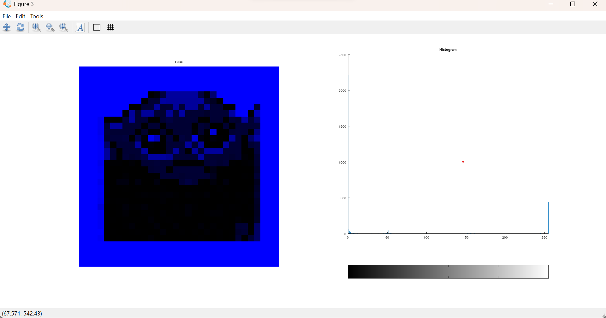

Difana Nanda Pridhasila Zein

2110131220017

# **Eksplorasi Octave Menggunakan Package Image**

Berikut adalah langkah dan hasil eksplorasi pengolahan Citra Digital menggunakan package <b>Image</b> yang ada pada <b>Octave</b>.

## **Foto yang digunakan berdimensi 32x32x3**

Sebelum menggunakan package image, kita harus mengaktifkannya terlebih dahulu. Langkah pertama yang harus dilakukan adalah masuk pada bagian <b>Command Windows</b> lalu  kita bisa menuliskan <b>pkg load image</b>. Selanjutnya, untuk mengetahui apakah package yang ingin digunakan sudah bisa diakses atau tidak, kita bisa menuliskan <b>pkg list</b>. Jika pada bagian package yang diinginkan sudah terdapat (*) maka package tersebut sudah dapat digunakan.

## **Penulisan menggunakan package image**

Dalam sebuah gambar yang diproses terdapat 3 lapisan layer, untuk layer pertama aberwarna merah, layer kedua berwarna hijau dan layer yang terakhir berwarna biru.

## **Citra Red**

## **Citra Green**

## **Citra Blue**

Untuk menghasilkan gambar seperti yang tertera diatas, terdapat beberapa fungsi yang digunakan : 

- **imread** 

imread berfungsi untuk membaca dimana file yang digunakan berada. 

- **imshow**

imahow berfungsi untuk menampilkan objek gambar.

- **imhist**

imhist berfungsi untuk menampilkan image dengan bentuk histogram.

- **subplot**

subplot berfungsi untuk memasukan objek kedalam satu figure atau menggabungkannya.

 

|  penulisan | Keterangan
| ----- | :--: |
foto | nama variabel dimana file Image itu disimpan
uint8 | Fungsi untuk menampilkan pixwl pada suatu image

