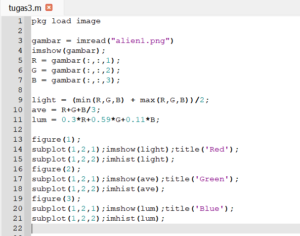
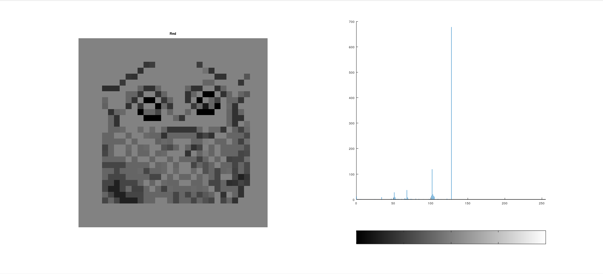
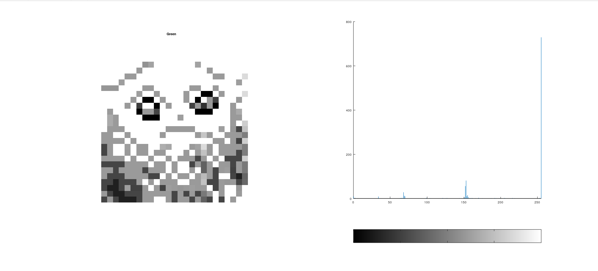
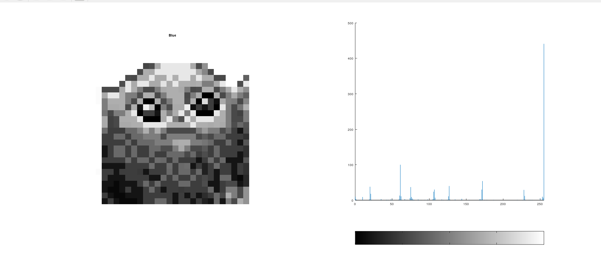
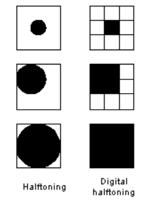
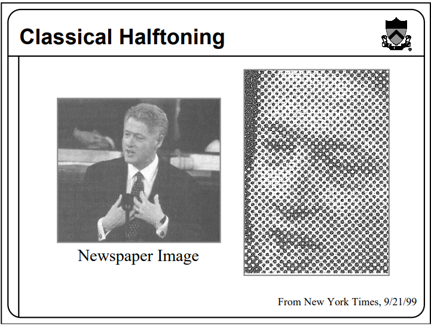
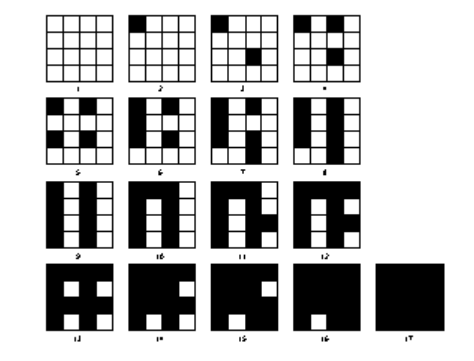
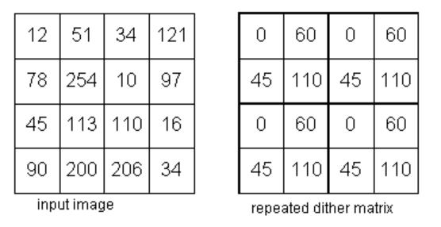
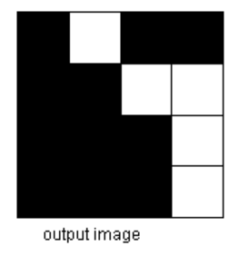

### **Lightness Method**

Metode yang sangat sederhana adalah dengan mengambil nilai rata-rata yaitu menjumlahkan nilai tertinggi dan terendah.

Kita dapat dengan mudah melihat bahwa metode ini menghadirkan kelemahan yang sangat serius karena satu komponen RGB tidak digunakan. Ini jelas merupakan masalah karena jumlah cahaya yang dilihat mata kita bergantung pada ketiga warna dasar.

### **Average Method**

Cara lain adalah dengan mengambil nilai rata-rata dari ketiga komponen (merah, hijau, dan biru).

Meskipun sekarang kita memperhitungkan semua komponen, metode rata-rata juga bermasalah karena memberikan bobot yang sama untuk setiap komponen. Berdasarkan penelitian tentang penglihatan manusia, kita tahu bahwa mata kita bereaksi terhadap setiap warna dengan cara yang berbeda. Secara khusus, mata kita lebih sensitif terhadap hijau, lalu merah, dan akhirnya biru. Oleh karena itu, bobot dalam persamaan di atas harus berubah.

### **Luminosity Method**

Metode terbaik adalah metode luminositas yang berhasil memecahkan masalah metode sebelumnya. Berdasarkan pengamatan di atas, kita harus mengambil rata-rata tertimbang dari komponen. Kontribusi warna biru pada nilai akhir harus berkurang, dan kontribusi warna hijau harus meningkat.

Metode lightness cenderung mengurangi kontras. Metode luminositas bekerja paling baik secara keseluruhan dan merupakan metode default yang digunakan jika Anda meminta untuk mengubah gambar dari RGB ke skala abu-abu.

<h1><b>HALFTONING</b></h1>

<b>Digital halftoning</b> adalah suatu proses untuk mengkonversi citra yang kontinu ke dalam suatu array berupa titik-titik. Jika dilihat oleh sistem visual manusia, pola tersebut akan  menciptakan  suatu  ilusi  sehingga  citra  tersebut  tampak  bukan  seperti  citra  hitam putih, namun seperti citra abu-abu yang kontinu.

Halftone adalah jenis efek visual statis yang diterapkan pada gambar digital dan cetak. Ini bekerja dengan prinsip yang sangat sederhana, di mana setiap piksel dalam area gambar dianggap sebagai titik dengan ukuran berbeda, beberapa di antaranya memakan lebih banyak ruang daripada satu piksel. Ketika gambar diubah menjadi halftone, tekstur gambar muncul seolah-olah telah ditempelkan di atas kumpulan titik tak terbatas tetapi tidak kontinu. Titik-titik tersebut sebenarnya tidak terbatas tetapi setara dengan resolusi total gambar. Gambar yang dihasilkan dikenal sebagai gambar halftone. Halftoning bertujuan  untuk  memberikan  kesan  warna  citra biner tampak  seperti citra abu-abu meskipun hanya menggunakan piksel warna hitam dan putih saja

<b>gambar halftone</b>

<h1><b>PATTERNING</b></h1>

Patterning adalah cara paling sederhana untuk menghasilkan gambar halftoning digital. Ini menghasilkan gambar yang memiliki resolusi spasial lebih tinggi daripada gambar sumber. Jumlah sel halftone citra keluaran sama dengan jumlah piksel citra sumber. Namun, setiap sel halftone dibagi lagi menjadi kotak 4x4. Setiap nilai piksel input diwakili oleh jumlah kotak terisi yang berbeda dalam sel halftone.

<b>Matriks pola rekursif</b>

<b>Operasi Pola</b>

Pattern menghasilkan gambar halftoning digital dari gambar input menggunakan teknik pola. Pola program membaca gambar input, mengkuantisasi nilai piksel, dan memetakan setiap piksel ke pola yang sesuai. Gambar yang dihasilkan 16 kali lebih besar dari aslinya.

<h1><b>DITHERING</b></h1>

Dithering juga merupakan salah satu cara untuk menghasilkan gambar halftoning. Tidak seperti pola, dithering membuat gambar keluaran dengan jumlah titik yang sama dengan jumlah piksel pada gambar sumber. Dithering dapat dianggap sebagai thresholding gambar sumber dengan matriks gentar. Matriks diletakkan berulang kali di atas gambar sumber. Dimanapun nilai piksel gambar lebih besar dari nilai dalam matriks, titik pada gambar output diisi.s

 

## Cara menentukan pola yang ada pada Patterning dan Dithering

- **Patterning**

Untuk menentukan banyaknya pola pada patterning kita bisa mengetahui secara langsung dengan menghitung banyaknya font biner atau pattern pengganti terlebih dahulu kemudian ditambahkan dengan 1.

Contoh : menggunakan 4 x 4 font biner, maka banyaknya pola didapat adalah 17 pola.

Pola yang ada pada patterning tidak boleh sama, pola yang sudah ada tidak boleh digunakan lagi (diputar dianggap sama).

- **Dithering**

