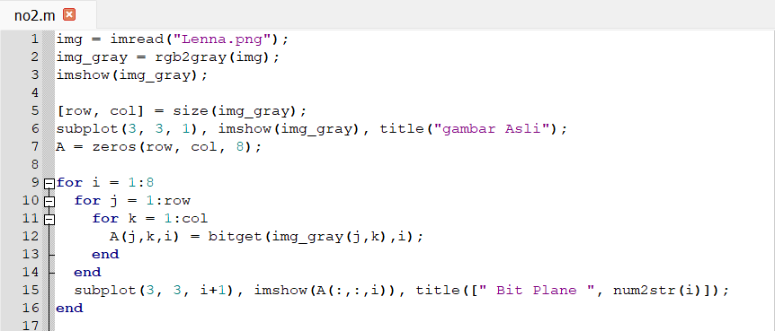
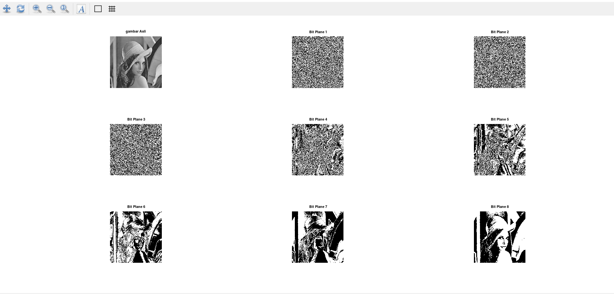
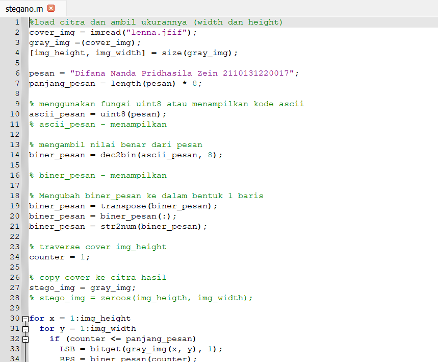
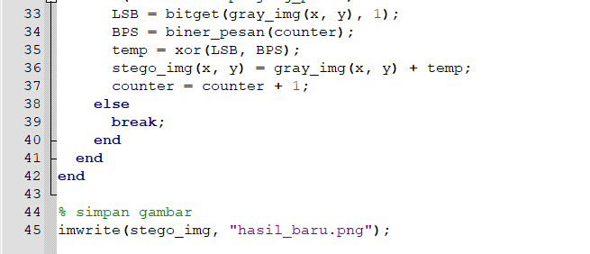
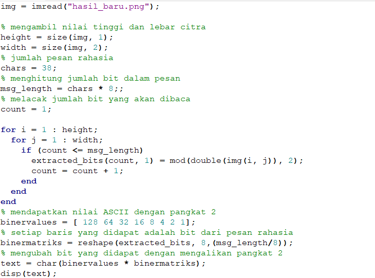
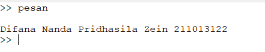
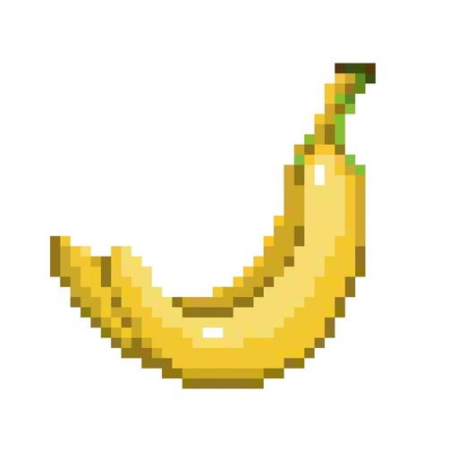
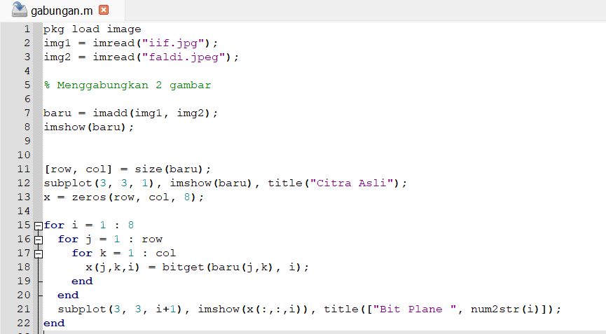
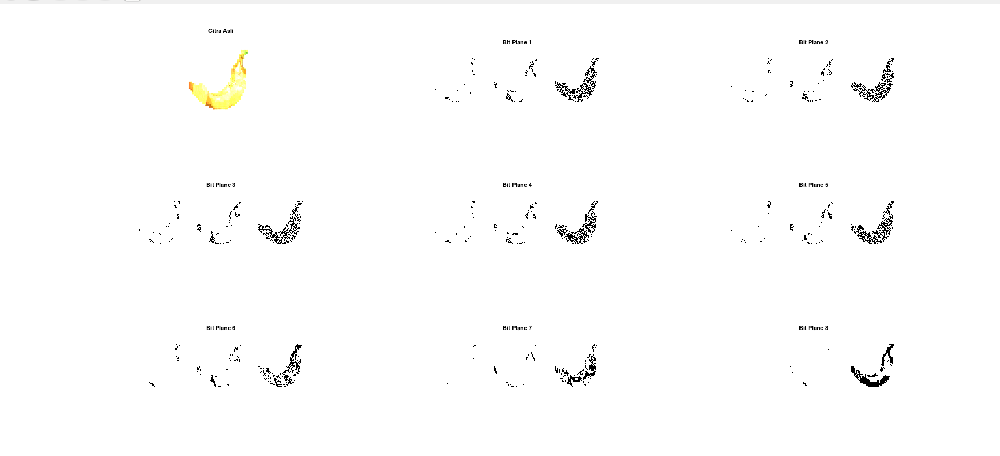

<h1>
<b>BIT PLANE SLICING</b>
</h1>

Untuk menguraikan bit plane slicing pada sebuah citra menggunakan pemrograman octave kita bisa menuliskan atau menggunakan fungsi bitget.
 

Langkah menguraikan bit plane slicing

- Untuk membaca citra yang digunakan kita bisa menggunakan imread

- Mengubah citra menjadi grayscale menggunakan fungsi rgb2gray

- Menampilkan citra yang sudah dirubah menggunakan imshow

- Membuat sebuah matriks sebanyak ukuran citra yang digunakan

- Mengatur posisi pada matriks menggunakan subplot

- Membuat variabel baru yang menyimpan nilai baris dan kolom agar menjadi nol

- Membuat 3 perulangan, perulangan pertama atau i dibuat untuk mengulang dari 1 sampai 8. Perulangan kedua akan mengulang sebanyak jumlah baris dan perulangan yang ketiga akan mengulang sebanyak kolom yang ada pada citra.

- Diluar perulangan gunakan fungsi sublot untuk mengatur posisi matriks dan buat counter agar keterangan yang ada selalu bertambah 1.

<h1>
<b>STEGANOGRAFI</b>
</h1>

Steganografi adalah sebuah metode dalam pemrosesan citra digital untuk menyembunyikan suatu data rahasia ke dalam sebuah citra.

Data yang disembunyikan dapat berupa:

- Gambar

- Teks

- Suara

- Dll

Code untuk menyisipkan pesan dalam sebuah citra

Citra asli

Citra yang sudah disisipkan pesan

Jika dilihat secara langsung, tidak ada perbedaan yang cukup mencolok antara citra yang belum disisipi pesan dan citra yang sudah disisipi pesan.

Untuk melihat pesan rahasia yang sudah disisipkan dalam sebuah citra kita bisa menggunakan

<h1>
<b>EKSPERIMEN TUKAR GAMBAR</b>
</h1>

Citra Iif Alifah

Citra Sopia Refaldi

Code untuk menggabungkan beberapa citra

Bit Plane Slicing dari 2 citra yang digabungkan

