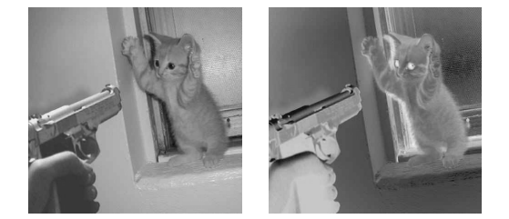
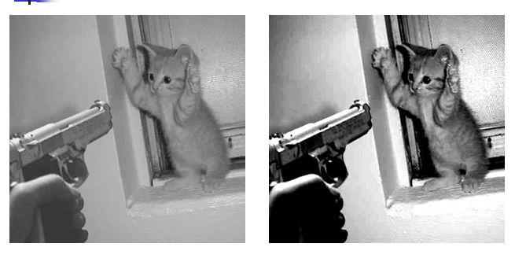
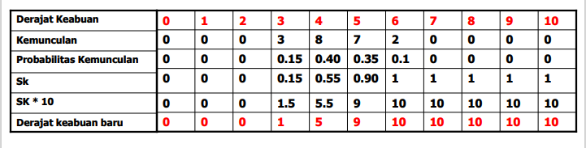
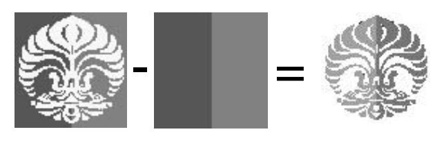
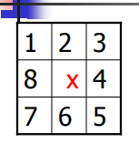

<h1>Metode Spasial dan Frekuensi Domain</h1>

Berdasarkan ranah (domain) operasinya, metode-metode untuk memperbaiki kualitas citra dapat dikelompokkan menjadi dua kategori : 

- Image enhancement dalam ranah spasial

Metode-metode image enhancement dalam ranah spasial dilakukan dengan memanipulasi secara langsung pixel-pixel di dalam citra.

- Image enhancement dalam ranah frekuensi

Metode-metode image enhancement dalam ranah frekuensi dilakukan dengan mengubah citra terlebih dahulu dari ranah spasial ke ranah frekuensi, baru kemudian memanipulasi nilai-nilai frekuens tersebut.

Masing-masing ranah operasi digunakan untuk tujuan yang spesifik, karena <b>tidak semua perbaikan citra dapat dilakukan dalam ranah spasial</b> begitu juga sebaliknya.

# **Domain Spasial**

Peningkatan mutu citra pada domain spasial terbagi menjadi dua yaitu : 

- Point Processing

- Mask Processing

### **1. Point Processing**

Cara paling mudah untuk melakukan peningkatan mutu pada domain spasial adalah dengan melakukan pemrosesan yang hanya melibatkan satu pixel saja.

- Image Negative

Mengubah nilai grey-level pixel citra input dengan : 

Hasilnya seperti klise foto :

- Contrast Stretching

Mengubah kontras dari suatu image dengan cara mengubah grey-level pixel pada citra menurut fungsi s = T(r) tertentu.

Hasil contrast stretching

- Histogram Equalization

Histogram : diagram yang menunjukkan jumlah kemunculan grey-level (0-255) pada suatu citra. Histogram equalization mengubah bentuk histrogram agar pemetaan grey-level pada citra juga berubah.

Hasil histogram equalization

- Image Substraction

Dilakukan jika kita ingin mengambil bagian tertntu saja dalam suatu citra.

Hasil image substraction

- Image Averaging

Dilakukan jika kita memiliki beberapa citra yang bergambar sama, namun semua citra mempunyai noise (gangguan). Noise satu citra berbeda dengan noise citra lainnya tidak berkorelasi, cara memperbaikinya adalah dengan melakukan operasi rata-rata terhadap semua citra tersebut.

# **Mask Processing**

Jika pada point processing kita hanya melakukan operasi terhadap masing-masing pixel, maka pada mask processing kita melakukan operasi terhadap suatu jendela ketatanggan pada citra.

Kemudia kita menerapkan (mengkonvulasikan) suatu maks terhadap jendela tersebut, mask juga sering disebut <b>filter.

Contoh : jendela ketetanggan 3x3, nilai pixel pada posisi x dipengaruhi oleh nilai tetangganya. Perbedaan dengan point processing, pada point processing nilai suatu pixel tidak dipengaruhi oleh nilai tetangganya sedangkan pada mask processing nilai pixel dipengaruhi oleh tetangganya.

### **Jenis-jenis filter spasial**

- Smoothing filters : lowspass filter dan median filter.

- Sharpening filter.