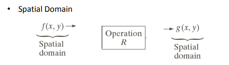
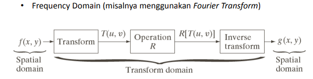

<h1>Metode Spasial dan Frekuensi Domain</h1>

Berdasarkan ranah (domain) operasinya, metode-metode untuk memperbaiki kualitas citra dapat dikelompokkan menjadi dua kategori : 

- Image enhancement dalam ranah spasial

Metode-metode image enhancement dalam ranah spasial dilakukan dengan memanipulasi secara langsung pixel-pixel di dalam citra.

- Image enhancement dalam ranah frekuensi

Metode-metode image enhancement dalam ranah frekuensi dilakukan dengan mengubah citra terlebih dahulu dari ranah spasial ke ranah frekuensi, baru kemudian memanipulasi nilai-nilai frekuens tersebut.

Masing-masing ranah operasi digunakan untuk tujuan yang spesifik, karena <b>tidak semua perbaikan citra dapat dilakukan dalam ranah spasial</b> begitu juga sebaliknya.
